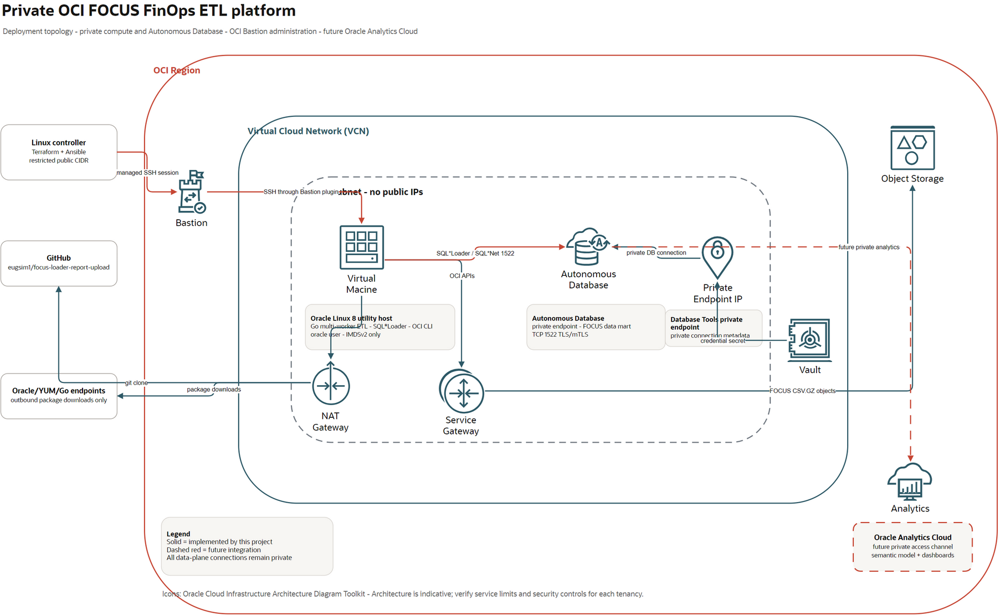
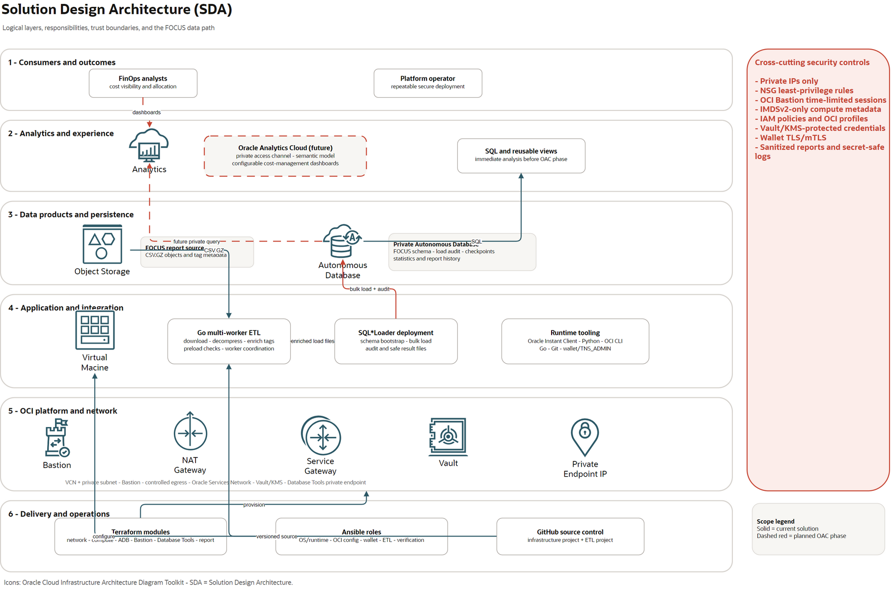

# Private OCI FOCUS FinOps ETL Platform

This project deploys and configures a private OCI utility environment for the
multi-worker FinOps ETL described in
[Building a Fast Multi-Worker ETL Pipeline for OCI FOCUS FinOps](https://www.linkedin.com/pulse/building-fast-multi-worker-etl-pipeline-oci-focus-finops-eugene-simos-vbytf/).
Terraform creates the private infrastructure and Ansible turns the Oracle Linux
host into a ready-to-run ETL node. Ansible clones the
[`eugsim1/focus-loader-report-upload`](https://github.com/eugsim1/focus-loader-report-upload)
project, installs its Go and Oracle runtime dependencies, creates the target
database schema, downloads the Autonomous Database wallet, and verifies the
private database connection.

The deployed utility reads OCI FOCUS cost-report objects from Object Storage,
processes multiple gzip CSV files concurrently, enriches and normalizes the
FOCUS rows, produces SQL*Loader-ready data, and loads it into an Autonomous AI
Database. Load status, SQL*Loader audit data, tag metadata, and restart
checkpoints make the pipeline suitable for repeatable FinOps processing rather
than a one-time import.

> This is an independent reference implementation. Review the source, IAM
> policies, database schema, cost model, and security controls before using it
> with production billing data.

## Why the platform is private

Cost and billing data is sensitive. The design therefore places both the ETL
Compute instance and Autonomous Database endpoint inside a private VCN:

- The Oracle Linux VNIC has no public IP and the subnet prohibits public IPs.
- Autonomous Database uses a private endpoint and a dedicated network security
  group; SQL traffic is limited to TLS/mTLS on TCP 1522 from the VCN.
- The VCN has no Internet Gateway. A NAT Gateway provides outbound-only access
  for GitHub, DNF, PyPI, and Oracle package repositories.
- A Service Gateway provides private routing to regional Oracle services,
  including Object Storage.
- OCI Bastion creates a temporary, controller-CIDR-restricted SSH path. No
  permanently running public jump host is required.
- The Compute instance enforces IMDSv2 and disables legacy metadata endpoints.
- SSH and OCI private keys remain on the Linux controller until Ansible copies
  only the explicitly configured OCI credential files with restrictive modes.
- Database Tools uses its own private endpoint and a Vault-backed password
  reference instead of embedding a password in the connection resource.

Oracle documents that an Autonomous Database private endpoint keeps database
traffic off the public Internet. See
[Autonomous Database private endpoint network access](https://docs.oracle.com/en-us/iaas/autonomous-database-serverless/doc/autonomous-network-access.html).

## Solution architecture

### OCI deployment topology

[](docs/architecture/oci-focus-private-finops.drawio)

This physical view shows the OCI Region, VCN, private subnet, managed Bastion,
private Compute host, private Autonomous Database, Database Tools private
endpoint, Vault, gateways, Object Storage, and the planned private Oracle
Analytics Cloud path.

### Solution Design Architecture (SDA)

[](docs/architecture/oci-focus-private-finops-sda.drawio)

The SDA view separates consumers, analytics, data products, ETL/application,
OCI platform, delivery/operations, and cross-cutting security controls. Solid
elements are implemented by this project; dashed red elements identify the
planned Oracle Analytics Cloud phase.

Both PNGs are generated from their linked editable Draw.io sources. They use
service stencils from Oracle's official
[OCI Architecture Diagram Toolkit](https://docs.oracle.com/en-us/iaas/Content/General/Reference/graphicsfordiagrams.htm).
Diagram sources, regeneration instructions, and scope notes are in
[`docs/architecture`](docs/architecture/README.md).

### End-to-end data and deployment flow

1. A Linux controller runs Terraform against OCI APIs and creates the VCN,
   private subnet, gateways, Compute instance, Bastion, Autonomous Database,
   Database Tools private endpoint, Vault, KMS key, and secret.
2. The controller opens a temporary OCI Bastion managed SSH session to the
   private Compute IP. Ansible connects as `oracle` using the controller's local
   SSH private key.
3. Ansible installs Python, OCI CLI, Git, the Go toolchain, Oracle Instant
   Client 26ai, SQL*Plus, SQL*Loader, and the optional minimal graphical tools.
4. Ansible clones the FOCUS ETL repository, deploys the target database schema,
   downloads and extracts the wallet, configures `TNS_ADMIN`, and validates an
   ADMIN connection through the Autonomous Database private endpoint.
5. The ETL lists objects below `FOCUS Reports/` in the Oracle-managed Object
   Storage cost-report bucket and applies date and checkpoint filters.
6. Concurrent Go workers download `.csv.gz` reports, decompress them, enrich
   FOCUS fields, resolve compartment hierarchy and tags, and produce
   deterministic SQL*Loader-ready CSV files.
7. SQL*Loader sends each transformed file over the private TLS/mTLS connection
   to Autonomous Database. Database load status and `SQLLOADER_AUDIT` retain
   operational outcomes and restart history.
8. Terraform and the deployment wrapper generate infrastructure and execution
   reports without writing passwords, wallet contents, or private-key contents.

### Current scope and roadmap

| Capability | Status | Purpose |
|---|---|---|
| Private Oracle Linux ETL node | Deployed | Runs the Go workers, OCI SDK, transformation, and SQL*Loader processes. |
| Autonomous Database private endpoint | Deployed | Stores queryable FOCUS cost, tag, audit, and checkpoint data. |
| OCI Bastion | Deployed | Provides temporary administrative SSH access to the private host. |
| OCI Database Tools private connection | Deployed | Enables a Vault-backed private database tools connection. |
| Oracle Analytics Cloud | Planned for the next blog | Will consume the private FOCUS data mart and expose configurable cost-management dashboards. |

The next article will add Oracle Analytics Cloud (OAC), a private access channel
to the Autonomous Database endpoint, a governed semantic model, and configurable
dashboards for cost trends, allocation, tag governance, anomalies, and
chargeback/showback. OAC is shown with a dashed border in the diagram because it
is **not** deployed by the current Terraform modules. Oracle documents that an
OAC private access channel can reach private data sources in an OCI VCN; see
[About Private Access Channels](https://docs.oracle.com/en-us/iaas/analytics-cloud/doc/private-access-channels.html).

## What this repository deploys

Terraform creates five modules:

- `network`: VCN, private subnet, private route table, NAT Gateway, Service
  Gateway, and subnet security list.
- `compute`: Oracle Linux 8 flexible VM, private VNIC, boot volume, `oracle`
  account bootstrap, Bastion agent, and IMDSv2-only metadata configuration.
- `bastion`: OCI Bastion service, plugin readiness test, and optional temporary
  managed SSH session.
- `autonomous_database`: ECPU Autonomous AI Database, private endpoint, NSG, and
  TLS/mTLS connection information.
- `database_tools`: service-managed private endpoint, dedicated NSG, Vault/KMS
  password secret or existing-secret reference, and private ADB connection.

Ansible then provisions the operating system, Oracle client software, OCI CLI,
Go, Git repository, wallet, SQL connection test, optional GUI, and optional
final FOCUS schema/load workflow.

## Project structure

```text
.
├── terraform/
│   ├── modules/
│   │   ├── network/
│   │   ├── compute/
│   │   ├── bastion/
│   │   ├── autonomous_database/
│   │   └── database_tools/
│   ├── terraform.tfvars.example
│   ├── report.tf
│   └── README.md
├── ansible/
│   ├── roles/oracle_client/
│   ├── inventory/hosts.yml.example
│   ├── group_vars/all.yml.example
│   ├── site.yml
│   └── README.md
├── scripts/
│   ├── deploy.sh
│   ├── run-ansible.sh
│   ├── renew-bastion-session.sh
│   ├── connect-oracle-server.sh
│   └── open-vnc-tunnel.sh
├── docs/architecture/
│   ├── oci-focus-private-finops.drawio
│   ├── oci-focus-private-finops.png
│   ├── oci-focus-private-finops-sda.drawio
│   ├── oci-focus-private-finops-sda.png
│   ├── generate-diagrams.ps1
│   └── README.md
├── reports/                  # generated locally; contents are ignored
├── SECURITY.md
└── SANITIZATION_REPORT.md
```

## Prerequisites on the Linux controller

- Terraform 1.6 or later
- Ansible Core 2.15 or later
- OpenSSH client, Bash, and OCI provider credentials
- An SSH key pair; Terraform reads its public-key file and installs the key for both `opc` and `oracle`, while Ansible reads the matching private-key file locally
- IAM permission to manage VCN, Compute, NAT Gateway, Bastion, and Bastion Session resources
- IAM permission to manage Autonomous Database, Network Security Groups, Database Tools, Vaults, Keys, and Secrets

The controller's public IP must be stable for the duration of the run and must match `controller_public_cidr`.

Open Internet access is rejected unless it is explicitly acknowledged with both `controller_public_cidr = "0.0.0.0/0"` and `allow_open_bastion_cidr = true`. Keep the override `false` outside temporary test environments.

Set `ssh_public_key_path` in `terraform.tfvars` to the public-key file on the controller. Terraform reads the file content; do not paste the OpenSSH key into the variables file.

Set `create_bastion_session = true` to create the temporary managed SSH session. `bastion_session_public_key_path` may point to a separate local `.pub` file; when it is `null`, Terraform reuses `ssh_public_key_path`. Only the public key is sent to OCI, while the matching private key stays on the Linux controller.

Set `compute_node_name` to control the OCI Compute display name and the naming prefix for its related network and Bastion resources.

Availability domains are discovered automatically from OCI using `compartment_id`. The names are sorted and `availability_domain_index = 0` is selected by default, so no tenancy-specific AD name is required in `terraform.tfvars`.

## Terraform deployment

```bash
cd terraform
cp terraform.tfvars.example terraform.tfvars
vi terraform.tfvars
read -rsp "ADB ADMIN password: " TF_VAR_adb_admin_password
export TF_VAR_adb_admin_password
terraform init
terraform fmt -recursive
terraform validate
terraform plan -var-file=terraform.tfvars -out=tfplan
terraform apply tfplan
```

Verify that no public address exists and obtain the Bastion command:

```bash
terraform output private_ip
terraform output public_ip
terraform output -raw bastion_ssh_command
terraform output available_availability_domains
terraform output selected_availability_domain
terraform output bastion_plugin_status
terraform output bastion_plugin_message
terraform output autonomous_database_private_endpoint
terraform output autonomous_database_private_ip
terraform output -raw terraform_csv_report
```

Terraform itself writes `reports/terraform-resources.csv` after a successful apply. It is a full inventory of the network, Compute node and IPs, Bastion/session/plugin, Autonomous Database/private endpoint, Database Tools connection/private endpoint, and Vault/key/secret identifiers. It excludes passwords, secret contents, wallet contents, and private-key contents. The end-to-end Bash wrapper additionally creates a timestamped execution report in the same directory.

The five modules summarized above have explicit dependencies: Compute waits for
Network, Bastion waits for Compute, Autonomous Database waits for Network, and
Database Tools waits for Autonomous Database. When
`create_bastion_session = true`, Terraform waits for
`bastion_plugin_wait_duration`, queries the live Compute Instance Agent status,
and blocks the session unless the `Bastion` plugin is `RUNNING`. When false, the
wait, test, and session are skipped while the Bastion service remains. The
default is `600s` because OCI documents that plugin enablement can take up to 10
minutes.

If OCI shows the plugin as **Enabled / Stopped**, apply the updated network and 600-second wait first. If it stays stopped, create an SSH port-forwarding session to the private IP on port 22; unlike managed SSH, port forwarding does not require Oracle Cloud Agent. Use the tunnel to restart and inspect `oracle-cloud-agent` on Linux. Detailed commands are in `terraform/README.md`.

The database has no public SQL endpoint because `subnet_id` and `private_endpoint_label` are set. The ADMIN password is a sensitive Terraform input. It is omitted from `terraform.tfvars.example`; secure the Terraform state because providers can retain sensitive values in state.

## How Ansible connects

Ansible targets the server's private IP as `oracle`. OpenSSH's `ProxyCommand` first connects to the regional OCI Bastion endpoint using the Bastion Session OCID as its SSH username. Bastion then forwards the SSH stream to `oracle@PRIVATE_IP:22`. Cloud-init creates `oracle` with the filesystem-loaded public key and passwordless sudo before Ansible connects.

The inventory pattern is:

```yaml
ansible_host: 10.30.1.10
ansible_user: oracle
ansible_ssh_private_key_file: /home/admin/.ssh/id_ed25519
ansible_ssh_common_args: >-
  -o ProxyCommand="ssh -i /home/admin/.ssh/id_ed25519 -W %h:%p -p 22 SESSION_OCID@host.bastion.eu-paris-1.oci.oraclecloud.com"
```

Create the files:

```bash
cd ../ansible
cp inventory/hosts.yml.example inventory/hosts.yml
cp group_vars/all.yml.example group_vars/all.yml
```

Replace the private IP, session OCID, region, and SSH private-key path in `inventory/hosts.yml`. Configure the local OCI config/API-key paths in `group_vars/all.yml`. Instant Client defaults to the Oracle 26ai DNF release channel, with Basic, Tools/SQL*Loader, and SQL*Plus packages.

Then run:

```bash
ansible-galaxy collection install -r requirements.yml
ansible -i inventory/hosts.yml oracle_linux -m wait_for_connection -a 'timeout=600'
ansible-playbook -i inventory/hosts.yml site.yml --syntax-check
ansible-playbook -i inventory/hosts.yml site.yml
```

Ansible waits for the managed SSH path, connects directly as `oracle`, confirms its local OCI credential source files exist, installs Python/OCI CLI/Git/Instant Client, configures `/home/oracle/.oci` with secure permissions, downloads and configures the Autonomous Database wallet, and clones `https://github.com/eugsim1/focus-loader-report-upload.git` into `/home/oracle/focus-loader-report-upload` as the `oracle` user. `oci_config_source` and `oci_private_key_source` are paths on the Ansible controller; both files are copied to the server with mode `0600`.

## One-command Linux deployment and report

From the project root:

```bash
cp terraform/terraform.tfvars.example terraform/terraform.tfvars
read -rsp "ADB ADMIN password: " TF_VAR_adb_admin_password
export TF_VAR_adb_admin_password
read -rsp "ADB wallet password (Enter to reuse ADMIN password): " ADB_WALLET_PASSWORD
export ADB_WALLET_PASSWORD="${ADB_WALLET_PASSWORD:-$TF_VAR_adb_admin_password}"
read -rsp "oracle VNC password: " ORACLE_VNC_PASSWORD
export ORACLE_VNC_PASSWORD
chmod +x scripts/deploy.sh scripts/run-ansible.sh scripts/renew-bastion-session.sh scripts/connect-oracle-server.sh scripts/open-vnc-tunnel.sh
./scripts/deploy.sh terraform.tfvars
```

After Terraform succeeds, the wrapper derives the SSH private-key path from the Terraform session public-key path, reads the controller's `$HOME/.oci/config`, discovers its `key_file`, generates the complete Ansible inventory and group variables, and runs Ansible through OCI Bastion. No placeholder substitution is required.

If the matching SSH private key cannot be derived by removing `.pub`, pass its path as argument 2:

```bash
./scripts/deploy.sh terraform.tfvars /secure/keys/bastion_key
```

Override OCI or debug discovery with environment variables:

```bash
OCI_CONFIG_SOURCE=/secure/oci/config \
OCI_PRIVATE_KEY_SOURCE=/secure/oci/api_key.pem \
APPLICATION_REPOSITORY_URL=https://github.com/example/another-repository.git \
APPLICATION_REPOSITORY_VERSION=main \
APPLICATION_REPOSITORY_DESTINATION=/home/oracle/another-repository \
ADB_WALLET_PASSWORD='replace-with-a-secure-password' \
ADB_WALLET_DIRECTORY=/home/oracle/adb_wallet \
ORACLE_VNC_PASSWORD='replace-with-a-vnc-password' \
ORACLE_GUI_VNC_GEOMETRY=1280x800 \
ANSIBLE_VERBOSITY=3 \
./scripts/deploy.sh terraform.tfvars
```

The same `APPLICATION_REPOSITORY_*` variables can be supplied to `scripts/run-ansible.sh`. `APPLICATION_REPOSITORY_VERSION` accepts a branch, tag, or commit and defaults to `HEAD`. The repository must be reachable by the target server through its NAT Gateway. The clone is idempotent, updates on later runs, preserves local modifications, and runs as `oracle`. After cloning, Ansible uses `git rev-parse --show-toplevel` on the target to verify and print the repository's full Linux installation path. The core role also installs Go 1.21 or newer, creates `/home/oracle/go/bin`, configures `GOROOT`, `GOPATH`, and `PATH` through `/etc/profile.d/go.sh`, and prints the verified Go installation details as `oracle`.

Wallet deployment is enabled by default. The runner reads the Autonomous Database OCID directly from Terraform output, downloads `/home/oracle/Wallet_AutonomousDatabase.zip`, extracts it securely to `/home/oracle/adb_wallet`, replaces `?/network/admin` in `sqlnet.ora` with that absolute directory, and configures `TNS_ADMIN` in both `/etc/environment` and `/etc/profile.d/oracle-adb-wallet.sh`. Supply `ADB_WALLET_PASSWORD`; when the end-to-end deployment wrapper is used, it falls back to `TF_VAR_adb_admin_password`. Use a separate strong wallet password in production. Set `ADB_WALLET_ENABLED=false` to skip wallet deployment. The OCI identity in `/home/oracle/.oci/config` must be authorized to generate an Autonomous Database wallet.

After Instant Client installation, Ansible installs and runs `/home/oracle/test_adb/test_adb_connection.sh`. The script finds the first `_high` alias in the wallet's `tnsnames.ora`, connects with SQLPlus as `ADMIN`, and prints the connected user, database, service, instance, timestamp, and exit status. The ADMIN password is read from `ADB_ADMIN_PASSWORD`, falling back to `TF_VAR_adb_admin_password`; it is neither stored in the script nor printed. Results remain in `/home/oracle/test_adb/last_test_result.txt`. Override the alias with `ADB_TNS_ALIAS=database_high`, or disable the test with `ADB_TEST_ENABLED=false`.

Debug output deliberately shows the wallet OCID, archive and installation paths, password configured state and length, extracted filenames, complete `sqlnet.ora`, selected high-service alias, and safe SQLPlus query results. Only the OCI wallet download and SQLPlus invocation remain under Ansible `no_log` because their module arguments contain passwords.

By default, wallet download and the SQLPlus test use `terraform output autonomous_database_id`. To target another Autonomous Database, set `ADB_DATABASE_ID`. When changing databases, use a different archive and extraction directory so an existing wallet is not reused by the idempotent `creates` checks:

```bash
export ADB_DATABASE_ID='ocid1.autonomousdatabase.oc1.eu-frankfurt-1...'
export ADB_WALLET_ARCHIVE_PATH='/home/oracle/Wallet_AnotherDatabase.zip'
export ADB_WALLET_DIRECTORY='/home/oracle/adb_wallet_another'
export ADB_WALLET_PASSWORD='another-wallet-password'
export ADB_ADMIN_PASSWORD='another-database-admin-password'
./scripts/run-ansible.sh
```

The alternate OCID and wallet path are included in the Ansible debug output and CSV report. Remove `ADB_DATABASE_ID` to return to the Terraform-created database.

If `oracle_adb_wallet_database_id` is empty during a direct `ansible-playbook` run, the role now executes `terraform -chdir=../terraform output -raw autonomous_database_id` on the controller and uses the result. It prints the Terraform lookup diagnostics, the complete safe JSON returned by `oci db autonomous-database get`, and a sanitized wallet-download result containing the return code, archive path, size, SHA-256 checksum, owner, mode, stdout, and stderr. Password arguments remain redacted.

The graphical interface uses the supported Oracle Linux 8 GNOME server environment with weak dependencies omitted, TigerVNC, and Firefox. It does not change the machine's default boot target or start a public display manager. Instead, `vncserver@:1.service` starts the desktop as `oracle`. VNC is forced to `127.0.0.1:5901`; no OCI security rule or host firewall opening is created. Supply `ORACLE_VNC_PASSWORD` before running Ansible. TigerVNC uses only the first eight password characters, so access must remain inside the SSH tunnel.

Open the secure tunnel from the Linux controller in a separate terminal:

```bash
chmod +x scripts/open-vnc-tunnel.sh
./scripts/open-vnc-tunnel.sh /secure/keys/bastion_key
```

Then connect a VNC viewer to `localhost:5901` and enter `ORACLE_VNC_PASSWORD`. Override the local port with `VNC_LOCAL_PORT=15901`. Disable graphical provisioning with `ORACLE_GUI_ENABLED=false`, or change resolution with `ORACLE_GUI_VNC_GEOMETRY=1600x900`.

Graphical provisioning is nonfatal. If GNOME, Firefox, TigerVNC, service startup, or verification fails, Ansible prints the failed GUI task and reason, writes `gui-provisioning-status.txt` on both the target and controller, and continues with wallet, database, and application configuration. The final CSV uses this status instead of reporting an unconditional GUI success.

The script writes the CSV deployment report and a verbose Ansible log under `reports/`. It requires `create_bastion_session = true`; when session creation is disabled, it finishes Terraform and stops before Ansible with guidance to use a directly routed inventory.

To rerun only Ansible against an existing active Terraform-managed session:

```bash
./scripts/run-ansible.sh
```

To run the cloned FOCUS loader as the final Ansible stage, explicitly enable it
and supply its settings from the controller environment:

```bash
read -rsp "ADB and FOCUS database password: " ADB_ADMIN_PASSWORD
echo
export ADB_ADMIN_PASSWORD
export FOCUS_LOADER_ENABLED=true
export FOCUS_LOADER_TARGET_SCHEMA=FOCUS_GIT1
export FOCUS_LOADER_DB_TNS_ALIAS=finops_high
export FOCUS_LOADER_NAMESPACE=bling
export FOCUS_LOADER_MINIMUM_DATE=2026-01-01
export FOCUS_LOADER_WORKERS=5
./scripts/run-ansible.sh
```

The stage is disabled by default. `FOCUS_LOADER_DROP_EXISTING=false` is also
the default; setting it to `true` permits destructive schema recreation. See
`ansible/README.md` for all variables, separate-password handling, OCI Vault
authentication, TNS alias auto-discovery, and verification behavior.

After Ansible completes, connect interactively as `oracle` without supplying any
parameters:

```bash
./scripts/connect-oracle-server.sh
```

Before its first SSH attempt, `run-ansible.sh` writes the resolved target
private IP, current Bastion session OCID/state, region, and private-key path to
the controller-only `reports/ssh-connection.env` file with mode `0600`. The
login helper uses this file without requiring any arguments; Terraform outputs
and the generated Ansible inventory are its fallbacks when the file does not exist. It constructs the SSH ProxyCommand
safely and refuses to connect when the recorded session is not `ACTIVE`. Renew
an expired session first with `scripts/renew-bastion-session.sh`.

The role intentionally separates required package installation from full OS patching. `oracle_update_all_packages` defaults to `false`, preventing unrelated enabled-repository conflicts from blocking Python, OCI CLI, and Instant Client setup. It installs Python 3.12 as the latest OL8.10 application runtime and uses Python 3.11 for the OCI CLI virtual environment according to Oracle's OL8 support matrix.

Instant Client installation uses `oracle-instantclient-release-26ai-el8` and the generic `oracle-instantclient-basic`, `oracle-instantclient-tools`, and `oracle-instantclient-sqlplus` RPM names. This avoids brittle, release-specific ZIP filenames. The Tools package supplies SQL*Loader and Oracle Data Pump utilities.

## Expired Bastion sessions

Sessions are deliberately temporary. Renew an expired or closed session and
immediately regenerate the inventory and rerun Ansible:

```bash
./scripts/renew-bastion-session.sh terraform.tfvars
```

Pass the matching private key as the second argument when it cannot be inferred
from `bastion_session_public_key_path`:

```bash
./scripts/renew-bastion-session.sh terraform.tfvars /secure/keys/bastion_key
```

The script targets and replaces the Terraform-managed session resource, creates
a fresh plan instead of reusing a potentially stale plan, waits for the new session to be
`ACTIVE`, and calls `scripts/run-ansible.sh`. That runner regenerates
`ansible/inventory/hosts.yml` with the new session OCID before testing SSH and
running the playbook. A refresh-only Terraform apply records any newer root
outputs that were absent from an older state without changing OCI resources.
Keep the required password and OCI environment variables exported in the same
shell.

To renew without immediately running Ansible:

```bash
RUN_ANSIBLE_AFTER_RENEWAL=false \
./scripts/renew-bastion-session.sh terraform.tfvars
```

You can then regenerate the inventory and run Ansible later with
`./scripts/run-ansible.sh`. The equivalent manual renewal command is:

```bash
cd terraform
terraform apply -var-file=terraform.tfvars -replace='module.bastion.oci_bastion_session.ansible[0]'
```

Update the inventory with the new session OCID, or rerun `scripts/deploy.sh`.

## Retrying a partial destroy

An Autonomous Database private endpoint uses a service-managed VNIC attached to the database NSG. OCI can briefly return from database deletion before that VNIC has detached, causing NSG deletion to fail with `412-PreconditionFailed`. The module now places `adb_private_endpoint_detach_wait_duration` (default `300s`) between database and NSG deletion.

For the deployment that has already failed during destroy, wait for this command to return an empty `data` list and then rerun destroy:

```bash
oci network nsg vnics list \
  --nsg-id ocid1.networksecuritygroup.oc1.eu-frankfurt-1.aaaa... \
  --all

cd terraform
terraform destroy -var-file=terraform.tfvars
```

Do not run `terraform apply` merely to add the delay to an already-partially-destroyed stack, because it can recreate resources. The barrier protects future deployments after it has first been included in a successful apply.

## Other private connectivity options

OCI Bastion is the default here. Ansible can instead run from a controller that already has private routing into the VCN through Site-to-Site VPN, FastConnect, DRG peering, or a CI runner inside the VCN. In those cases, remove the `ProxyCommand` and connect directly to the private IP.

## Security

- Never commit Terraform state/tfvars, generated inventory, OCI config, or private keys.
- Use a `/32` controller CIDR where possible.
- The NAT Gateway allows outbound connections only; it does not make the server reachable from the Internet.
- Autonomous Database accepts TLS and mTLS SQL connections on TCP 1522 only from the VCN CIDR through its NSG; Database Tools reaches it through a separate service-managed private endpoint.
- Store Terraform state in an encrypted, access-controlled backend because it can contain the database ADMIN password.
- Rotate or revoke the OCI API signing key if the target server is compromised.
