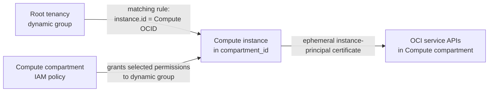

# Compute instance principal IAM

## Placement model

OCI supports using a Compute instance as an instance principal, so software on
the node can call OCI APIs without a user API signing key.

There is one important placement constraint:

- The **dynamic group is tenancy-level**. Its Terraform `compartment_id` must
  be the root tenancy OCID (`tenancy_id`). OCI does not permit a dynamic group
  to be created inside the Compute compartment.
- The **policy is compartment-scoped**. This project attaches it to the same
  `compartment_id` that contains the Compute node and all other application
  resources. The policy can grant access in that compartment and descendants,
  but not in a parent or sibling compartment.



The split is required by OCI; it is not a Terraform workaround. The module
therefore exposes both placement outputs so the difference is visible.

## Files

The reusable module is under:

```text
terraform/modules/iam_instance_principal/
  main.tf
  variables.tf
  outputs.tf
  versions.tf
```

The root stack passes `module.compute.instance_id` into the module. The default
matching rule consequently admits only the node created by this Terraform
state:

```text
instance.id = '<current Compute instance OCID>'
```

If Terraform replaces the Compute instance, it also updates the matching rule
to the new instance OCID. OCI IAM propagation can take time after a rule or
policy change.

## Enable it

Add the root tenancy OCID and feature settings to `terraform/terraform.tfvars`:

```hcl
tenancy_id                    = "ocid1.tenancy.oc1..aaaa..."
iam_instance_principal_enabled = true

iam_instance_principal_compartment_permissions = [
  "read autonomous-database-family",
]

iam_instance_principal_match_all_instances_in_compartment = false
```

The default permission produces this policy statement:

```text
Allow dynamic-group <generated-name> to read autonomous-database-family in compartment id <compartment_id>
```

That permission supports inspecting the project Autonomous Database and
generating its wallet. Add only the services the workload actually uses:

```hcl
iam_instance_principal_compartment_permissions = [
  "read autonomous-database-family",
  "read object-family",  # only if the application reads Object Storage
  "read secret-bundles", # only if it retrieves a Vault secret
]
```

Inputs are permission fragments, not complete statements. Do not include
`Allow dynamic-group` or `in compartment`; the module builds and scopes those
parts consistently.

Generated names include the existing compartment-derived immutable suffix.
Override them only when required:

```hcl
iam_instance_principal_dynamic_group_name = "my-compute-instance-principal-dg"
iam_instance_principal_policy_name        = "my-compute-instance-principal-policy"
```

Names must be unique in their OCI IAM scope.

## Plan and apply

The identity running Terraform must already be authorized to create dynamic
groups at tenancy level and manage policies in the target compartment. A
compartment administrator who lacks tenancy-level dynamic-group permission
cannot create this module.

```bash
cd terraform
terraform fmt -recursive
terraform init
terraform validate
terraform plan -var-file=terraform.tfvars -out=tfplan
terraform apply tfplan
```

Inspect the resulting placement and exact permissions:

```bash
terraform output -raw iam_dynamic_group_name
terraform output -raw iam_dynamic_group_compartment_id
terraform output -raw iam_policy_name
terraform output -raw iam_policy_compartment_id
terraform output -raw iam_dynamic_group_matching_rule
terraform output -json iam_policy_statements
```

Expected:

- `iam_dynamic_group_compartment_id` equals `tenancy_id`.
- `iam_policy_compartment_id` equals `compartment_id`.
- The default matching rule contains the single `instance_id`.
- `resource_compartment_ids` still contains only `compartment_id`; it includes
  the IAM policy and intentionally excludes the required tenancy-level dynamic
  group.

## Ansible behavior

`scripts/run-ansible.sh` reads `iam_instance_principal_enabled` from Terraform.
When it is `true`, the generated group variables use:

```yaml
oracle_oci_auth_mode: "instance_principal"
oracle_oci_region: "eu-frankfurt-1"
```

In this mode:

- the controller does not require a local OCI CLI config or API private key;
- Ansible does not copy those user credentials to the Compute node;
- OCI CLI wallet operations use `--auth instance_principal`;
- the FOCUS loader uses its `-ip` option;
- `/etc/profile.d/oci-auth.sh` sets `OCI_CLI_AUTH=instance_principal` and the
  region for later interactive `oracle` sessions.

`OCI_AUTH_MODE=api_key` can explicitly retain the legacy behavior. Use
`OCI_AUTH_MODE=instance_principal` only when equivalent IAM already exists
outside this stack.

## Verify from the Compute node

Allow time for IAM propagation, then connect as `oracle` and compare the
metadata instance ID with the Terraform matching rule:

```bash
curl -fsS \
  -H 'Authorization: Bearer Oracle' \
  http://169.254.169.254/opc/v2/instance/id

oci db autonomous-database get \
  --auth instance_principal \
  --region eu-frankfurt-1 \
  --autonomous-database-id ocid1.autonomousdatabase...
```

To test the exact operation used by Ansible:

```bash
read -rsp 'Wallet password: ' WALLET_PASSWORD
export WALLET_PASSWORD
oci db autonomous-database generate-wallet \
  --auth instance_principal \
  --region eu-frankfurt-1 \
  --autonomous-database-id ocid1.autonomousdatabase... \
  --file /tmp/Wallet_test.zip \
  --password "$WALLET_PASSWORD" \
  --generate-type SINGLE
unset WALLET_PASSWORD
```

Delete the test archive after verification because it contains database
connection material.

Typical failures:

- `404-NotAuthorizedOrNotFound` immediately after apply: wait for IAM
  propagation, confirm the instance OCID in the matching rule, and retry.
- The ADB can be read but Object Storage or Vault access fails: add the
  corresponding least-privilege permission fragment and reapply.
- A resource in another compartment is denied: a policy attached to the
  Compute compartment cannot grant access to a sibling or parent. Create a
  separately reviewed policy at the nearest common ancestor.
- A replacement instance is temporarily denied: wait for the updated dynamic
  group rule to propagate.

## Security guidance

Keep exact-instance matching unless every node in the compartment truly needs
the same authority. Setting
`iam_instance_principal_match_all_instances_in_compartment = true` changes the
rule to:

```text
instance.compartment.id = '<compartment_id>'
```

That is convenient for an autoscaled fleet but materially broader. Also treat
SSH and local process execution on the node as privileged: a user or process
that can run on the instance may be able to use its instance-principal
permissions. Restrict SSH, sudo, application accounts, and executable
deployment paths accordingly.

Official references:

- [Managing dynamic groups](https://docs.oracle.com/en-us/iaas/Content/Identity/dynamicgroups/managingdynamicgroups.htm)
- [Calling services from an instance](https://docs.oracle.com/iaas/Content/Identity/callresources/callingservicesfrominstances.htm)
- [Configuring the SDK, CLI, or Terraform for instance principals](https://docs.oracle.com/en-us/iaas/Content/Identity/callresources/Configuring_the_SDK_CLI_or_Terraform.htm)
- [OCI CLI Autonomous Database wallet generation](https://docs.oracle.com/en-us/iaas/tools/oci-cli/latest/oci_cli_docs/cmdref/db/autonomous-database/generate-wallet.html)
